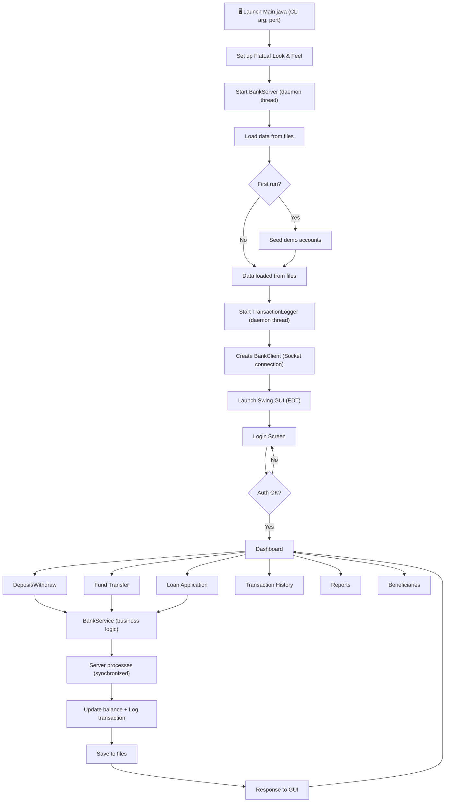
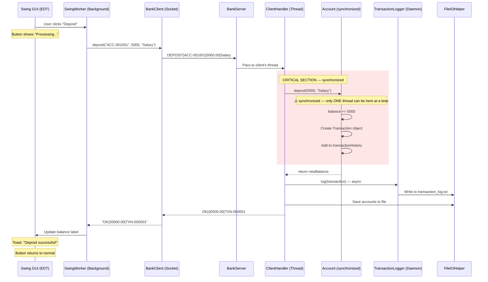
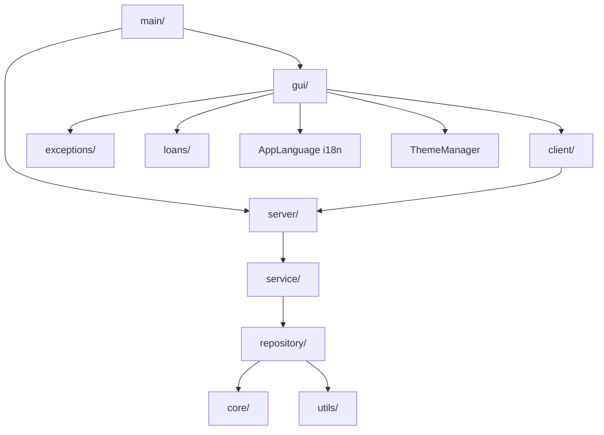

# 🏦 SecureBank — Cooperative Banking Management System


> A modern, full-featured desktop banking operations platform built with **Core Java** — Swing GUI, TCP Sockets, file-based persistence, multithreading, and generics. Capstone project for "Object Oriented Techniques using Java" at NIET Greater Noida.

---

## ✨ Features

### 🏛️ Core Banking
- **Multi-account banking** — Savings & Current accounts with distinct interest rates (4% / 1%)
- **Client-server architecture** — TCP socket-based communication with per-client threading
- **Thread-safe transactions** — `synchronized` deposit/withdraw preventing race conditions
- **Fund transfers** — Account-to-account with deadlock-safe lock ordering
- **Loan management** — Application, approval, EMI calculation, disbursement pipeline
- **Transaction history** — Searchable/filterable with Lambda/Stream expressions
- **File persistence** — Character stream (BufferedReader/BufferedWriter) based data storage
- **Async logging** — Daemon thread transaction logger with BlockingQueue
- **Generic Repository** — Reusable `Repository<T>` CRUD pattern with Predicate-based search
- **Reports & Analytics** — TreeMap-sorted reports with Java2D bar charts

### 🆕 New Features (v1.1)
- **Saved Payees / Beneficiaries** — Manage trusted payee accounts with instant add/remove, server-side validation, and loading skeleton UI
- **i18n — English & Hindi** — Full internationalization via `AppLanguage` with HashMap-backed translations; switch languages live from Settings
- **Dedicated ThemeManager** — Production-grade design token system with gradients, glass effects, and shadow constants. Themes: **Neon**, **Navy Blue**, **Darker Black**
- **Dynamic Font Scaling** — Three font sizes (Small / Medium / Large) applied globally at runtime
- **BankService Layer** — Unified service class separating business logic from the TCP protocol layer
- **Login Security Lockout** — Configurable failed-attempt lockout with countdown feedback
- **Interactive Knowledge Graph** — Full codebase visualized as a D3.js force graph (1,164 nodes, 3,167 edges, 57 communities) — see [graph section](#-knowledge-graph) below

### 🎨 UI / UX
- **Modern GUI** — FlatLaf-powered Swing with sidebar navigation, card-based dashboard, toast notifications
- **Dark mode** — FlatLightLaf ↔ FlatDarkLaf toggle
- **Custom components** — Rounded cards, styled inputs, progress buttons, toast notifications, Java2D mini-charts

---

## 🛠️ Tech Stack

| Technology | Usage |
|-----------|-------|
| **Java 17+ (SE)** | Core language, OOP, collections, generics |
| **Java Swing** | GUI framework (JFrame, JPanel, JTable, CardLayout) |
| **FlatLaf 3.7.2** | Modern flat Look-and-Feel for Swing |
| **TCP Sockets** | `java.net.ServerSocket` / `Socket` for client-server |
| **java.io** | `BufferedReader`/`BufferedWriter` for file persistence |
| **java.util.concurrent** | `BlockingQueue`, `AtomicInteger` for thread safety |
| **Java2D** | Custom painting for charts and rounded components |
| **Maven** | Build tool and dependency management |
| **HashMap (i18n)** | Fast key-lookup translations via `AppLanguage` |

---

## 🏗️ Architecture Overview

SecureBank uses a **client-server architecture** running on a single machine:

1. **BankServer** opens a `ServerSocket` on a configurable port (default: 8888)
2. **Swing GUI client** connects via `Socket` to the server
3. Each client connection spawns a **dedicated `ClientHandler` thread** (implements `Runnable`)
4. The server holds **shared repositories** (accounts, customers) protected by `synchronized` methods
5. A **BankService** layer mediates between handlers and domain objects
6. A **daemon thread** (`TransactionLogger`) asynchronously logs transactions to file
7. On shutdown, a **shutdown hook** saves all in-memory data to text files

All communication uses a simple text-based protocol over TCP:
```
Request:  COMMAND|param1|param2|...
Response: OK|result_data   OR   ERROR|error_message
```

---

## 📊 System Flow



---

## 🔄 Sequence Diagram — Deposit Flow (Concurrency Safety)



---

## 📁 Package Structure

```
com.securebank/
├── core/                    → Domain model classes
│   ├── Account.java         → Abstract base class (synchronized, overloaded)
│   ├── SavingsAccount.java  → 4% interest, extends Account
│   ├── CurrentAccount.java  → 1% interest, overdraft support
│   ├── Customer.java        → Customer entity (Association with Account)
│   ├── Bank.java            → Top-level entity (Aggregation with Branch)
│   ├── Branch.java          → Branch entity
│   └── Transferable.java    → Interface for fund transfer capability
│
├── transactions/            → Transaction handling
│   ├── Transaction.java     → Immutable transaction record (Composition)
│   ├── TransactionType.java → Enum of transaction types
│   └── TransactionLogger.java → Daemon thread for async logging
│
├── loans/                   → Loan management
│   ├── Loan.java            → Loan entity with EMI calculation
│   ├── LoanStatus.java      → Loan lifecycle enum
│   └── LoanProcessor.java   → Eligibility checking & approval
│
├── exceptions/              → Custom checked exceptions
│   ├── InsufficientBalanceException.java
│   ├── InvalidPinException.java
│   ├── AccountNotFoundException.java
│   ├── DailyLimitExceededException.java
│   └── DuplicateAccountException.java
│
├── repository/              → Generic data access layer
│   ├── Repository.java      → Generic Repository<T> with HashMap
│   ├── AccountRepository.java → Repository<Account> wrapper
│   └── CustomerRepository.java → Repository<Customer> wrapper
│
├── service/                 → 🆕 Business logic layer
│   └── BankService.java     → Unified service mediating handlers ↔ domain objects
│
├── server/                  → TCP server
│   ├── BankServer.java      → ServerSocket, accept loop, data seeding
│   └── ClientHandler.java   → Runnable, per-client protocol handler
│
├── client/                  → TCP client
│   └── BankClient.java      → Socket connection, high-level API
│
├── gui/                     → Swing screens
│   ├── SecureBankApp.java   → Main JFrame shell, CardLayout
│   ├── LoginPanel.java      → Login form with SwingWorker auth + lockout
│   ├── DashboardPanel.java  → Card-based dashboard
│   ├── AccountsPanel.java   → Account details & interest
│   ├── DepositWithdrawPanel.java → Deposit/Withdraw form
│   ├── TransferPanel.java   → Fund transfer form
│   ├── LoanPanel.java       → Loan application & status
│   ├── TransactionHistoryPanel.java → Searchable history (JTable)
│   ├── ReportsPanel.java    → TreeMap-sorted analytics
│   ├── BeneficiariesPanel.java → 🆕 Saved payee management
│   ├── SettingsPanel.java   → Dark mode, language, font size
│   ├── ThemeManager.java    → 🆕 Centralized design token system
│   └── AppLanguage.java     → 🆕 i18n — English / Hindi HashMap lookup
│
├── gui/components/          → Reusable custom components
│   ├── SidebarPanel.java    → Dark navy sidebar navigation
│   ├── CardPanel.java       → Rounded card with shadow
│   ├── StyledButton.java    → Modern button with loading state
│   ├── NotificationPanel.java → Toast notifications
│   ├── StyledTextField.java → Input with placeholder text
│   └── MiniChart.java       → Java2D bar chart
│
├── utils/                   → Utility classes
│   ├── FileIOHelper.java    → BufferedReader/Writer file persistence
│   ├── ReceiptGenerator.java → StringBuilder-based receipt formatting
│   └── IDGenerator.java     → Thread-safe AtomicInteger ID generation
│
└── main/                    → Application entry point
    └── Main.java            → CLI arg parsing, FlatLaf setup, server + GUI launch
```

---

## 🚀 Setup & Run Instructions

### Prerequisites
- **Java 17+** (JDK, not just JRE) — [Download](https://www.oracle.com/java/technologies/downloads/)
- **Maven 3.8+** (optional — only needed if rebuilding from source)

### Option 1: Run from Source (Development)

```bash
# 1. Clone/navigate to the project
cd SecureBank

# 2. Compile and package (downloads FlatLaf automatically)
mvn compile

# 3. Run with default port (8888)
mvn exec:java -Dexec.mainClass="com.securebank.main.Main"

# OR run with a custom port
mvn exec:java -Dexec.mainClass="com.securebank.main.Main" -Dexec.args="9090"
```

### Option 2: Run from JAR

```bash
# 1. Build the fat JAR
mvn package

# 2. Run the JAR
java -jar target/securebank-1.0-SNAPSHOT.jar

# OR with custom port
java -jar target/securebank-1.0-SNAPSHOT.jar 9090
```

### Option 3: Windows Executable

```bash
# 1. Build the fat JAR first
mvn package

# 2. Run the packaging script (requires WiX Toolset)
package.bat
```

### Demo Credentials (auto-seeded on first run)

> These are seeded demo accounts for local evaluation only — never reuse PINs like these in any real deployment. PINs are stored as salted PBKDF2 hashes (see `PinHasher`), never in plaintext.

| Customer ID | Name | PIN | Accounts |
|------------|------|-----|----------|
| CUSTOMER-1 | Divyansh Kashiv | 1234 | ACC-001001 (Savings ₹25,000), ACC-001002 (Current ₹50,000) |
| CUSTOMER-2 | Priya Sharma | 5678 | ACC-001003 (Savings ₹15,000) |
| CUSTOMER-3 | Rahul Verma | 9012 | ACC-001004 (Savings ₹35,000) |

---

## 📸 Screenshots

### Login Screen

*Secure login with Customer ID and PIN — lockout protection after failed attempts*

### Dashboard

*Dashboard — account balance, quick actions, recent transactions, chart*

### Deposit / Withdraw

*Deposit and Withdraw form with real-time balance and receipt generation*

### Fund Transfer

*Deadlock-safe fund transfer between accounts*

### Transaction History

*Searchable, filterable transaction history with Lambda/Stream expressions*

### Loan Management

*Loan application, EMI calculation, approval and disbursement pipeline*

### Reports & Analytics

*TreeMap-sorted account analytics with Java2D bar charts*

### Settings — Themes & i18n

*Settings — Neon / Navy Blue / Darker Black themes, English / Hindi language toggle, dynamic font scaling*

---

## 🗺️ Knowledge Graph

SecureBank's entire codebase has been indexed into an interactive **knowledge graph** — 1,164 nodes across 57 communities, connected by 3,167 edges extracted via static AST analysis.


*Force-directed knowledge graph — each color represents a code community (class cluster). Node size = number of connections. Generated using D3.js force-directed layout.*

### How to Explore the Graph

**Option 1 — Interactive HTML (Recommended)**
```bash
# From the project root, start a local server
cd .planning/graphs
python -m http.server 8888
# Then open: http://localhost:8888/graph_fancy.html
```

Features of the interactive viewer:
- 🎨 **57 community colors** — each cluster glows with its own neon palette
- 🔍 **Search** — jump to any class/method by name
- 🏘️ **Community filter** — toggle visibility of entire packages
- 📊 **Min connections slider** — focus on high-connectivity hubs
- 🗺️ **Live minimap** — navigate the full graph from a birds-eye view
- 🖱️ **Drag, zoom, pan** — D3.js physics simulation

**Option 2 — Obsidian Vault**
```bash
# Export graph to interconnected Markdown files
python export_obsidian.py
# Then open the 'obsidian_graph/' folder as a vault in Obsidian
# Go to Graph View to see your codebase as an Obsidian knowledge graph
```

---

## 🐛 Common Debugging Points

| # | Problem | Fix |
|---|---------|-----|
| 1 | **Port already in use** — `BindException: Address already in use` | Another instance is running. Kill it or use a different port: `java -jar securebank.jar 9090` |
| 2 | **File not found on first run** | Normal — the `data/` directory is auto-created on first run. |
| 3 | **GUI freezes** during operations | Socket calls must be on a SwingWorker thread, not the EDT. |
| 4 | **Race condition in balance** | Ensure `synchronized` is on BOTH `deposit()` and `withdraw()` in `Account.java`. |
| 5 | **Deadlock during transfers** | The `transferTo()` method uses lock ordering (by account number) to prevent deadlocks. Never change the order. |
| 6 | **Data lost after restart** | Ensure `saveToFile()` is called before shutdown. The shutdown hook in `Main.java` handles this automatically. |
| 7 | **FlatLaf not loading** | Build with `mvn package` to create a fat JAR that bundles FlatLaf. |
| 8 | **TransactionLogger not writing** | Check that the `data/` directory exists and is writable. |
| 9 | **Language not switching** | Call `AppLanguage.setLanguage("hi")` and trigger `rebuildUI()` on all panels. |
| 10 | **Theme not applying** | Ensure `ThemeManager.setTheme(Theme.NEON)` is called before `SwingUtilities.updateComponentTreeUI()`. |

---

## 📝 Viva-Ready Explanation Notes

### Why Synchronization Was Needed

In our client-server architecture, **multiple clients can connect simultaneously**, each running on its own thread. If two clients try to modify the **same account balance** at the same time without protection:

```
Thread A reads balance = ₹10,000
Thread B reads balance = ₹10,000    ← Both see the SAME value!
Thread A withdraws ₹8,000 → sets balance = ₹2,000
Thread B withdraws ₹8,000 → sets balance = ₹2,000  ← WRONG! Should be rejected!
```

The `synchronized` keyword creates a **monitor lock** on the Account object, ensuring only ONE thread executes `deposit()` or `withdraw()` at a time.

### Why TCP Sockets Were Chosen

**TCP** guarantees three things critical for banking:
1. **Reliable delivery** — no data is lost (unlike UDP)
2. **Ordered delivery** — messages arrive in sequence
3. **Error detection** — corrupted data is retransmitted

### Why Generics (`Repository<T>`) Matter

With `Repository<T>`, we write the CRUD logic ONCE and reuse it:
- `Repository<Account>` — type-safe, compiler prevents inserting a Customer
- `Repository<Customer>` — same code, different type
- `Repository<Loan>` — same code, different type

### Why HashMap for i18n (`AppLanguage`)

`HashMap<String, String>` provides **O(1) average-case lookup** for translation keys — far faster than iterating over arrays or properties files. Keys like `"sidebar.dashboard"` return `"Dashboard"` or `"डैशबोर्ड"` instantly.

---

## 🚀 Future Scope (v2 — Post-Exam)

- **Spring Boot + REST API** — replace TCP sockets with RESTful endpoints
- **Database** — migrate from file-based persistence to MySQL/PostgreSQL using JDBC or Hibernate
- **Web frontend** — React-based dashboard alongside the Swing client
- **Authentication** — JWT-based auth with password hashing (bcrypt)
- **Multi-branch support** — cross-branch transfers, branch-specific accounts
- **Email notifications** — transaction alerts via JavaMail
- **PDF statements** — generate downloadable account statements using iText
- **Docker deployment** — containerized server for cloud hosting

---

## 📄 License

This project is developed for academic evaluation at NIET Greater Noida. All rights reserved by the project team.

---

*Built with ❤️ for the OOP Using Java Capstone — NIET Greater Noida, Semester III*

---

<br><br>

# 🏦 SecureBank: Comprehensive Examination & Viva Guide

This document is your definitive guide for the final project examination. It covers the project from its basic inception to its advanced architectural design, assigns specific speaking roles to the team, and provides a clear breakdown of concepts to present to the examiner.

---

## 1. Introduction: How It Started

### The Vision
The **SecureBank** project began with a core objective: to build a robust, real-world banking application using strictly **Core Java**. Instead of relying on heavy web frameworks, the goal was to prove a deep understanding of Java fundamentals—specifically Object-Oriented Programming (OOP), Multithreading, Network Sockets, and GUI design.

### Target Users
SecureBank is designed for **Bank Tellers, Branch Managers, and Administrators** in a cooperative banking environment. It provides a secure, centralized dashboard for staff to:
* Register and manage customers.
* Process high-volume deposits, withdrawals, and fund transfers.
* Approve and manage loans.
* Manage saved payees (beneficiaries).
* Generate transaction histories and visual reports.

### Key Professional Features
* **Massive Concurrency:** Capable of handling dozens of customers simultaneously without data corruption, thanks to a strictly synchronized, thread-safe server architecture.
* **Dynamic Professional Theming:** Features a state-of-the-art **ThemeManager** engine allowing real-time switching between professional themes: **Neon**, **Navy Blue**, and **Darker Black**, along with dynamic font scaling for accessibility.
* **Full Internationalization (i18n):** English and Hindi supported natively using a `HashMap`-backed `AppLanguage` class — switchable live from the Settings panel.
* **Saved Payees:** A dedicated Beneficiaries panel to manage trusted payee accounts with server-side validation.
* **Data Persistence:** A custom file I/O system that securely writes all transactional data to local `.dat` files.

---

## 2. Architecture & Folder Structure



### Folder Breakdown
* **`com.securebank.main`**: The entry point. Initializes the theme engine, starts the server, and launches the GUI.
* **`com.securebank.core`**: The domain model (`Customer`, `Account`, `SavingsAccount`, `CurrentAccount`).
* **`com.securebank.service`**: 🆕 Business logic layer (`BankService`) separating protocol handling from domain operations.
* **`com.securebank.gui`**: The frontend. All screens + `ThemeManager` (design tokens) + `AppLanguage` (i18n).
* **`com.securebank.server` & `client`**: The networking backbone. TCP socket server and client wrapper.
* **`com.securebank.repository`**: The data layer. Generic `Repository<T>` for type-safe CRUD.
* **`com.securebank.utils`**: `FileIOHelper`, `IDGenerator`, `ReceiptGenerator`.

---

## 3. Team Roles & Viva Assignments

### 👨‍💻 Divyansh — Technical Lead & System Architect
**Topics:**
1. **Client-Server Architecture & Sockets** — `BankServer` + `ServerSocket`, custom TCP protocol
2. **Concurrency & Multithreading** — per-client `ClientHandler` threads
3. **The `synchronized` Keyword** — race condition prevention on `Account`
4. **Generics (`Repository<T>`)** — write-once CRUD reused across all entity types
5. **ThemeManager & FlatLaf** — dynamic `UIManager` property swapping
6. **AppLanguage (i18n)** — `HashMap`-backed translation lookup, O(1) performance
7. **Knowledge Graph** — codebase visualized as 1,164-node interactive graph

### 👥 The Rest of the Team — Business Logic & OOP Fundamentals
**Topics:**
1. **Classes and Objects** — `Customer.java` as blueprint, instances in memory
2. **Inheritance & Polymorphism** — `SavingsAccount`/`CurrentAccount` → `Account`; `calculateInterest()` polymorphism
3. **Encapsulation** — `private` balances, `deposit()`/`withdraw()` as controlled mutators
4. **Exception Handling** — `InsufficientBalanceException`, `InvalidPinException` with try/catch toast feedback
5. **Beneficiaries & Fund Transfers** — saved payee management flow
6. **Feature Walkthrough** — demonstrate all panels to the examiner

---

## 4. Feature Walkthrough & Screenshots

### The Login Screen
Secure entry with Customer ID + PIN, plus lockout protection after repeated failures.


### The Dashboard
Centralized hub: account overview, quick actions, recent transactions.


### Dynamic Settings & Theming
Real-time theme switching (Neon / Navy Blue / Darker Black) + English/Hindi language toggle + font scaling.
> *Examiner Note: Emphasize that most Java Swing projects look outdated. This project uses dynamic look-and-feel updates to rival modern web applications.*


### Fund Transfers (Deadlock-Safe)
Lock-ordering prevents deadlocks when two accounts transfer to each other simultaneously.


### Transaction History & Reports
Java Collections (`TreeMap`, `Stream`) to sort and filter large transaction datasets.


### Knowledge Graph Visualization
The full codebase mapped as an interactive force-directed graph.


---

## 5. Quick Test & Demo Guide (For Examiners)

1. **Launch the Application**: Run `SecureBank.exe` or start via IDE.
2. **Enter Customer ID**: `CUSTOMER-1`
3. **Enter PIN**: `1234`
4. **Click Login**: Authenticated instantly → routed to the secure dashboard.

| Customer ID | PIN  | Owner Name       | Notes                                      |
|-------------|------|------------------|--------------------------------------------|
| `CUSTOMER-1`| `1234` | Divyansh Kashiv | Has both a Savings and a Current account.  |
| `CUSTOMER-2`| `5678` | Priya Sharma    | Great for testing fund transfers.          |
| `CUSTOMER-3`| `9012` | Rahul Verma     | Test loan applications with this account.  |

---
*End of Examination Guide. Print this document to PDF and distribute it to the team before the Viva.*
