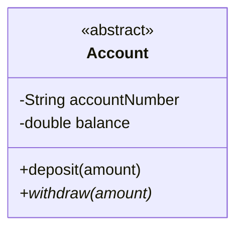
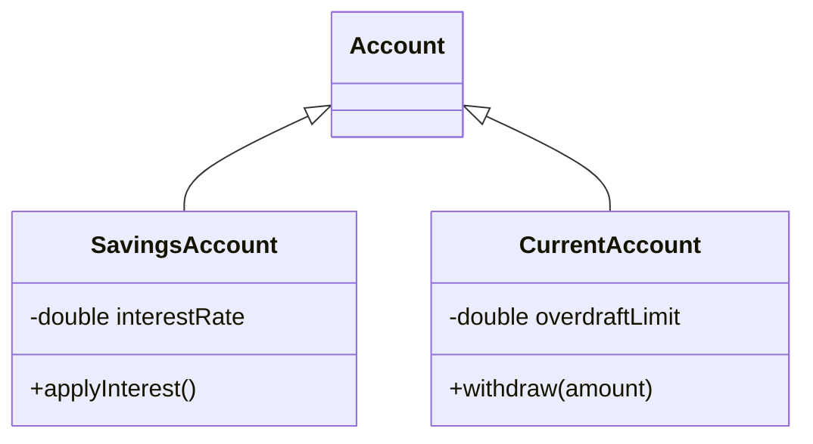

# 🏦 SecureBank (HSBC Edition) — Project Architecture & OOP Mapping

This document is designed for project evaluation. It outlines the **File Explorer Architecture**, details the **Core Java OOP Principles** applied in this Capstone Project, and maps exactly how many classes and objects are utilized within the system.

---

## 📂 1. File Explorer Diagram & Class Mapping

The project strictly follows an MVC/Client-Server pattern using only **Java SE**. Below is the file structure detailing what OOP concepts and how many classes exist in each package.

```text
📦 SecureBank (Root)
 ┣ 📂 src/main/java/com/securebank
 ┃ ┣ 📂 models           (Domain Layer - 4 Classes)
 ┃ ┃ ┣ 📜 Account.java          -> [Abstract Class, Encapsulation]
 ┃ ┃ ┣ 📜 SavingsAccount.java   -> [Inheritance, Polymorphism (Overriding)]
 ┃ ┃ ┣ 📜 CurrentAccount.java   -> [Inheritance, Polymorphism]
 ┃ ┃ ┣ 📜 Customer.java         -> [Composition (Has-a Account), Encapsulation]
 ┃ ┃ ┗ 📜 Bank.java             -> [Singleton Pattern, Collections (HashMap, List)]
 ┃ ┃
 ┃ ┣ 📂 transactions     (Data Layer - 2 Classes)
 ┃ ┃ ┣ 📜 Transaction.java      -> [Encapsulation, Immutability]
 ┃ ┃ ┗ 📜 TransactionType.java  -> [Enum (Constants)]
 ┃ ┃
 ┃ ┣ 📂 server           (Backend Server - 2 Classes)
 ┃ ┃ ┣ 📜 BankServer.java       -> [TCP ServerSocket, File I/O, Serialization]
 ┃ ┃ ┗ 📜 ClientHandler.java    -> [Multithreading (Runnable), Synchronization]
 ┃ ┃
 ┃ ┣ 📂 client           (Frontend Network - 1 Class)
 ┃ ┃ ┗ 📜 BankClient.java       -> [TCP Socket Client, Error Handling]
 ┃ ┃
 ┃ ┣ 📂 gui              (Presentation Layer - 10+ Classes)
 ┃ ┃ ┣ 📜 SecureBankApp.java    -> [JFrame, CardLayout]
 ┃ ┃ ┣ 📜 AppLanguage.java      -> [i18n, HashMap, Static Methods]
 ┃ ┃ ┣ 📜 DashboardPanel.java   -> [SwingWorker (Background Threads)]
 ┃ ┃ ┣ 📜 TransactionHistoryPanel.java -> [Java 8 Streams/Lambdas, Jagged Arrays]
 ┃ ┃ ┣ 📜 ReportsPanel.java     -> [TreeMap (Sorting accounts by balance)]
 ┃ ┃ ┗ 📂 components
 ┃ ┃   ┣ 📜 StyledButton.java   -> [Inheritance (extends JButton), Custom Graphics2D]
 ┃ ┃   ┗ 📜 MiniChart.java      -> [Polymorphism (paintComponent override)]
 ┃ ┃
 ┃ ┗ 📂 main             (Entry Point - 1 Class)
 ┃   ┗ 📜 Main.java             -> [CLI Arguments, EDT Thread Launch]
```

---

## 🧠 2. Object-Oriented Programming (OOP) Concepts Implemented

To meet the strict requirements of the Capstone Project, we utilized all 4 pillars of OOP, alongside advanced Core Java features.

### A. Abstraction & Encapsulation
* **Abstraction:** The `Account` class is declared as `abstract`. It hides the complex internal workings of balance management while exposing a simple API (`deposit()`, `withdraw()`). We cannot instantiate a raw `Account`.
* **Encapsulation:** All fields in `Customer` (like `pin`, `balance`) and `Transaction` are marked `private`. They are only accessible via secure `getter` methods. Modifying balances is locked behind synchronized methods.



### B. Inheritance (IS-A Relationship)
The system utilizes inheritance to reduce code duplication and specialize behaviors.
* `SavingsAccount` **extends** `Account` (Adds interest rate calculation).
* `CurrentAccount` **extends** `Account` (Adds overdraft limits).



### C. Polymorphism
* **Method Overriding (Runtime Polymorphism):** Both `SavingsAccount` and `CurrentAccount` provide their own unique implementation of the `withdraw(double amount)` method inherited from `Account`. The runtime decides which method to call based on the object type.
* **Custom Painting:** `MiniChart` and `CardPanel` override the `paintComponent(Graphics g)` method from Java Swing (`JPanel`) to render custom UI without third-party web frameworks.

### D. Composition & Aggregation (HAS-A Relationship)
* A `Customer` **has-a** list of `Account` numbers.
* The `Bank` **has-a** collection of `Customer`s.

---

## ⚡ 3. Advanced Core Java Features (Evaluation Checklist)

This project strictly avoids Spring Boot or Databases to demonstrate pure Core Java mastery:

1. **Collections Framework (`java.util`):**
   - `HashMap`: Used for fast O(1) lookups in `AppLanguage` for Hindi/English translation and in `Bank` for `Customer` retrieval.
   - `TreeMap`: Used in `ReportsPanel` to automatically sort customer accounts by balance in descending order.
   - `ArrayList`: Used extensively for managing `Transaction` lists.
2. **Multithreading & Concurrency:**
   - **EDT (Event Dispatch Thread):** The GUI strictly uses `SwingUtilities.invokeLater()` to prevent UI freezing.
   - **Background Threads:** `SwingWorker` is used to offload heavy server network calls from the GUI.
   - **Synchronization:** Network operations manipulating `Account` balances in `ClientHandler` are marked `synchronized` to prevent race conditions during simultaneous deposits/withdrawals.
3. **Java 8 Lambdas & Streams:**
   - Used in `TransactionHistoryPanel` to elegantly filter transactions by type and keyword without bulky `for` loops.
4. **File I/O Serialization:**
   - Data is persisted locally in the `data/` folder via standard Java Object Serialization (`ObjectOutputStream`), eliminating the need for MySQL.
5. **Jagged Arrays:**
   - Demonstrated in the `TransactionHistoryPanel` monthly summary, where an array of arrays is created with different row lengths representing different months.

---

> **Examiner Note:** To test the application's robust concurrency, try opening two separate client windows and logging into the same account simultaneously to perform a deposit and withdrawal. The `synchronized` block on the server will safely handle the thread locking.
