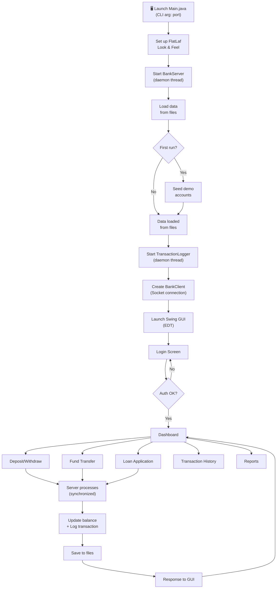
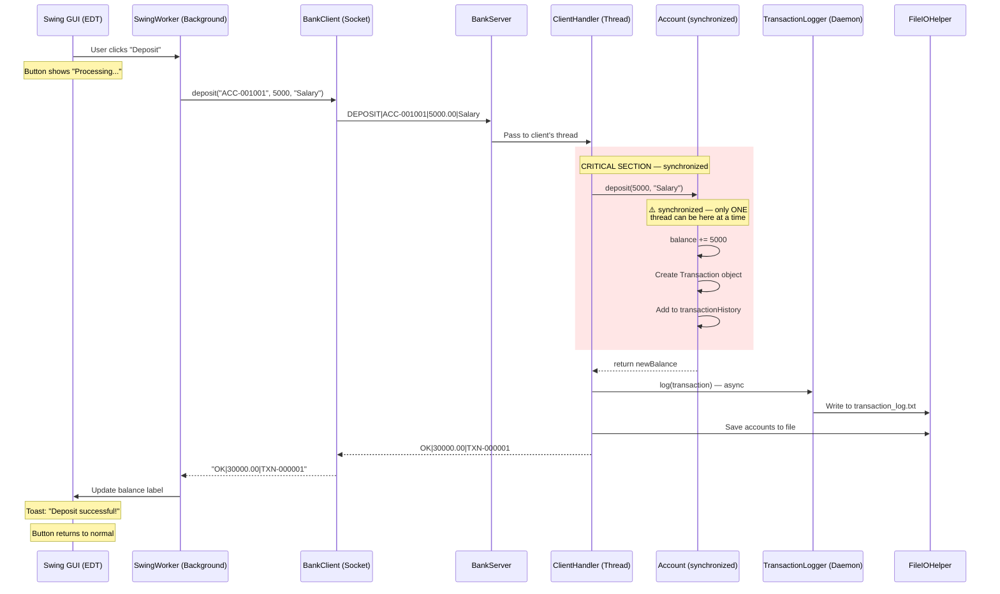
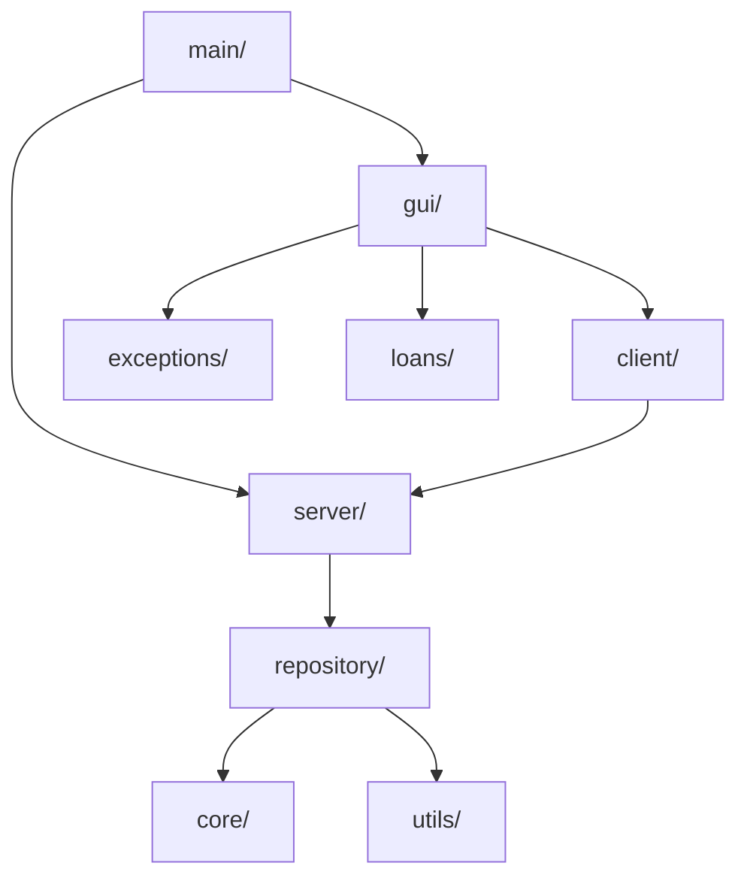

# 🏦 SecureBank — Cooperative Banking Management System


> A modern, full-featured desktop banking operations platform built with **Core Java** — Swing GUI, TCP Sockets, file-based persistence, multithreading, and generics. Capstone project for "Object Oriented Techniques using Java" at NIET Greater Noida.

---

## ✨ Features

- **Multi-account banking** — Savings & Current accounts with distinct interest rates
- **Client-server architecture** — TCP socket-based communication with per-client threading
- **Thread-safe transactions** — `synchronized` deposit/withdraw preventing race conditions
- **Modern GUI** — FlatLaf-powered Swing with sidebar navigation, card-based dashboard, toast notifications
- **Fund transfers** — Account-to-account with deadlock-safe lock ordering
- **Loan management** — Application, approval, EMI calculation, disbursement
- **Transaction history** — Searchable/filterable with Lambda/Stream expressions
- **File persistence** — Character stream (BufferedReader/BufferedWriter) based data storage
- **Async logging** — Daemon thread transaction logger with BlockingQueue
- **Dark mode** — FlatLightLaf ↔ FlatDarkLaf toggle
- **Generic Repository** — Reusable `Repository<T>` CRUD pattern with Predicate-based search
- **Reports & Analytics** — TreeMap-sorted reports with Java2D bar charts

---

## 🛠️ Tech Stack

| Technology | Usage |
|-----------|-------|
| **Java 17+ (SE)** | Core language, OOP, collections, generics |
| **Java Swing** | GUI framework (JFrame, JPanel, JTable, CardLayout) |
| **FlatLaf 3.7.2** | Modern flat Look-and-Feel for Swing |
| **TCP Sockets** | `java.net.ServerSocket` / `Socket` for client-server |
| **java.io** | `BufferedReader`/`BufferedWriter` for file persistence |
| **java.util.concurrent** | `BlockingQueue`, `AtomicInteger` for thread safety |
| **Java2D** | Custom painting for charts and rounded components |
| **Maven** | Build tool and dependency management |

---

## 🏗️ Architecture Overview

SecureBank uses a **client-server architecture** running on a single machine:

1. **BankServer** opens a `ServerSocket` on a configurable port (default: 8888)
2. **Swing GUI client** connects via `Socket` to the server
3. Each client connection spawns a **dedicated `ClientHandler` thread** (implements `Runnable`)
4. The server holds **shared repositories** (accounts, customers) protected by `synchronized` methods
5. A **daemon thread** (`TransactionLogger`) asynchronously logs transactions to file
6. On shutdown, a **shutdown hook** saves all in-memory data to text files

All communication uses a simple text-based protocol over TCP:
```
Request:  COMMAND|param1|param2|...
Response: OK|result_data   OR   ERROR|error_message
```

---

## 📊 System Flow



---

## 🔄 Sequence Diagram — Deposit Flow (Concurrency Safety)

This is the most important diagram — it shows exactly how `synchronized` prevents race conditions:



---

## 📁 Package Structure

```
com.securebank/
├── core/                    → Domain model classes
│   ├── Account.java         → Abstract base class (synchronized, overloaded)
│   ├── SavingsAccount.java  → 4% interest, extends Account
│   ├── CurrentAccount.java  → 1% interest, overdraft support
│   ├── Customer.java        → Customer entity (Association with Account)
│   ├── Bank.java            → Top-level entity (Aggregation with Branch)
│   ├── Branch.java          → Branch entity
│   └── Transferable.java    → Interface for fund transfer capability
│
├── transactions/            → Transaction handling
│   ├── Transaction.java     → Immutable transaction record (Composition)
│   ├── TransactionType.java → Enum of transaction types
│   └── TransactionLogger.java → Daemon thread for async logging
│
├── loans/                   → Loan management
│   ├── Loan.java            → Loan entity with EMI calculation
│   ├── LoanStatus.java      → Loan lifecycle enum
│   └── LoanProcessor.java   → Eligibility checking & approval
│
├── exceptions/              → Custom checked exceptions
│   ├── InsufficientBalanceException.java
│   ├── InvalidPinException.java
│   ├── AccountNotFoundException.java
│   ├── DailyLimitExceededException.java
│   └── DuplicateAccountException.java
│
├── repository/              → Generic data access layer
│   ├── Repository.java      → Generic Repository<T> with HashMap
│   ├── AccountRepository.java → Repository<Account> wrapper
│   └── CustomerRepository.java → Repository<Customer> wrapper
│
├── server/                  → TCP server
│   ├── BankServer.java      → ServerSocket, accept loop, data seeding
│   └── ClientHandler.java   → Runnable, per-client protocol handler
│
├── client/                  → TCP client
│   └── BankClient.java      → Socket connection, high-level API
│
├── gui/                     → Swing screens
│   ├── SecureBankApp.java   → Main JFrame shell, CardLayout
│   ├── LoginPanel.java      → Login form with SwingWorker auth
│   ├── DashboardPanel.java  → Card-based dashboard
│   ├── AccountsPanel.java   → Account details & interest
│   ├── DepositWithdrawPanel.java → Deposit/Withdraw form
│   ├── TransferPanel.java   → Fund transfer form
│   ├── LoanPanel.java       → Loan application & status
│   ├── TransactionHistoryPanel.java → Searchable history (JTable)
│   ├── ReportsPanel.java    → TreeMap-sorted analytics
│   └── SettingsPanel.java   → Dark mode toggle
│
├── gui/components/          → Reusable custom components
│   ├── SidebarPanel.java    → Dark navy sidebar navigation
│   ├── CardPanel.java       → Rounded card with shadow
│   ├── StyledButton.java    → Modern button with loading state
│   ├── NotificationPanel.java → Toast notifications
│   ├── StyledTextField.java → Input with placeholder text
│   └── MiniChart.java       → Java2D bar chart
│
├── utils/                   → Utility classes
│   ├── FileIOHelper.java    → BufferedReader/Writer file persistence
│   ├── ReceiptGenerator.java → StringBuilder-based receipt formatting
│   └── IDGenerator.java     → Thread-safe AtomicInteger ID generation
│
└── main/                    → Application entry point
    └── Main.java            → CLI arg parsing, FlatLaf setup, server + GUI launch
```

---

## 🚀 Setup & Run Instructions

### Prerequisites
- **Java 17+** (JDK, not just JRE) — [Download](https://www.oracle.com/java/technologies/downloads/)
- **Maven 3.8+** (optional — only needed if rebuilding from source)

### Option 1: Run from Source (Development)

```bash
# 1. Clone/navigate to the project
cd SecureBank

# 2. Compile and package (downloads FlatLaf automatically)
mvn compile

# 3. Run with default port (8888)
mvn exec:java -Dexec.mainClass="com.securebank.main.Main"

# OR run with a custom port
mvn exec:java -Dexec.mainClass="com.securebank.main.Main" -Dexec.args="9090"
```

### Option 2: Run from JAR

```bash
# 1. Build the fat JAR
mvn package

# 2. Run the JAR
java -jar target/securebank-1.0-SNAPSHOT.jar

# OR with custom port
java -jar target/securebank-1.0-SNAPSHOT.jar 9090
```

### Option 3: Windows Executable

```bash
# 1. Build the fat JAR first
mvn package

# 2. Run the packaging script (requires WiX Toolset)
package.bat
```

### Demo Credentials (auto-seeded on first run)

| Customer ID | Name | PIN | Accounts |
|------------|------|-----|----------|
| CUSTOMER-1 | Deepanshu Kumar | 1234 | ACC-001001 (Savings ₹25,000), ACC-001002 (Current ₹50,000) |
| CUSTOMER-2 | Priya Sharma | 5678 | ACC-001003 (Savings ₹15,000) |
| CUSTOMER-3 | Rahul Verma | 9012 | ACC-001004 (Savings ₹35,000) |

---

## 📸 Screenshots

> Take screenshots of the running app and save them in the `screenshots/` folder.


*Login screen — enter Customer ID and PIN*


*Dashboard — account balance, quick actions, recent transactions, chart*


*Deposit and Withdraw form with real-time balance*


*Fund transfer between accounts*


*Searchable, filterable transaction history table*


*Loan application form and status panel*


*Reports with TreeMap-sorted account balances and chart*


*Settings with Tabbed Interface for dynamic Font Scaling and Professional Themes (Neon, Navy Blue, Darker Black)*

---

## 🐛 Common Debugging Points

| # | Problem | Fix |
|---|---------|-----|
| 1 | **Port already in use** — `BindException: Address already in use` | Another instance is running. Kill it or use a different port: `java -jar securebank.jar 9090` |
| 2 | **File not found on first run** | Normal — the `data/` directory is auto-created on first run. If it's deleted, restart the app. |
| 3 | **GUI freezes** during operations | Socket calls are being made on the EDT instead of a SwingWorker. All network calls MUST be on background threads. |
| 4 | **Race condition in balance** | Ensure `synchronized` keyword is on BOTH `deposit()` and `withdraw()` methods in `Account.java`. |
| 5 | **Deadlock during transfers** | The `transferTo()` method uses lock ordering (locks by account number order) to prevent deadlocks. Never change the lock order. |
| 6 | **Data lost after restart** | Ensure `saveToFile()` is called before shutdown. The shutdown hook in `Main.java` handles this automatically. |
| 7 | **FlatLaf not loading** | The FlatLaf JAR must be on the classpath. Use the Maven shade plugin to build a fat JAR that includes it. |
| 8 | **TransactionLogger not writing** | Check that the `data/` directory exists and is writable. The logger is a daemon thread — if the app exits too fast, some logs may be lost. |

---

## 📝 Viva-Ready Explanation Notes

### Why Synchronization Was Needed

In our client-server architecture, **multiple clients can connect simultaneously**, each running on its own thread. If two clients try to modify the **same account balance** at the same time without protection:

```
Thread A reads balance = ₹10,000
Thread B reads balance = ₹10,000    ← Both see the SAME value!
Thread A withdraws ₹8,000 → sets balance = ₹2,000
Thread B withdraws ₹8,000 → sets balance = ₹2,000  ← WRONG! Should be rejected!
```

This is called a **race condition** — the result depends on the order threads execute. The `synchronized` keyword creates a **monitor lock** on the Account object, ensuring only ONE thread can execute `deposit()` or `withdraw()` at a time. Thread B must WAIT for Thread A to finish.

### Why TCP Sockets Were Chosen

**TCP (Transmission Control Protocol)** guarantees three things critical for banking:
1. **Reliable delivery** — no data is lost (unlike UDP)
2. **Ordered delivery** — messages arrive in the sequence they were sent
3. **Error detection** — corrupted data is retransmitted

Imagine a deposit confirmation getting lost with UDP — the customer thinks their money was deposited, but it wasn't. TCP prevents this by requiring acknowledgments for every message.

### Why Generics (`Repository<T>`) Matter

Without generics, we'd need separate repository classes for every entity type:
- `AccountRepository` with `HashMap<String, Account>`
- `CustomerRepository` with `HashMap<String, Customer>`
- `LoanRepository` with `HashMap<String, Loan>`

All with identical `add()`, `get()`, `update()`, `delete()` logic — code duplication!

With `Repository<T>`, we write the logic ONCE and reuse it:
- `Repository<Account>` — type-safe, compiler prevents inserting a Customer
- `Repository<Customer>` — same code, different type
- `Repository<Loan>` — same code, different type

Java implements this via **type erasure** — `<T>` is replaced with `Object` at compile time, and the compiler inserts casts automatically.

---

## 🚀 Future Scope (v2 — Post-Exam)

The following enhancements are planned for **v2**, to be built AFTER the current exam cycle:

- **Spring Boot + REST API** — replace TCP sockets with RESTful endpoints
- **Database** — migrate from file-based persistence to MySQL/PostgreSQL using JDBC or Hibernate
- **Web frontend** — React-based dashboard alongside the Swing client
- **Authentication** — JWT-based auth with password hashing (bcrypt)
- **Multi-branch support** — cross-branch transfers, branch-specific accounts
- **Email notifications** — transaction alerts via JavaMail
- **PDF statements** — generate downloadable account statements using iText
- **Docker deployment** — containerized server for cloud hosting

---

## 📄 License

This project is developed for academic evaluation at NIET Greater Noida. All rights reserved by the project team.

---

*Built with ❤️ for the OOP Using Java Capstone — NIET Greater Noida, Semester III*

<br><br>

# 🏦 SecureBank: Comprehensive Examination & Viva Guide

This document is your definitive guide for the final project examination. It covers the project from its basic inception to its advanced architectural design, assigns specific speaking roles to the team, and provides a clear breakdown of concepts to present to the examiner.

---

## 1. Introduction: How It Started

### The Vision
The **SecureBank** project began with a core objective: to build a robust, real-world banking application using strictly **Core Java**. Instead of relying on heavy web frameworks, the goal was to prove a deep understanding of Java fundamentals—specifically Object-Oriented Programming (OOP), Multithreading, Network Sockets, and GUI design.

### Target Users
SecureBank is designed for **Bank Tellers, Branch Managers, and Administrators** in a cooperative banking environment. It provides a secure, centralized dashboard for staff to:
* Register and manage customers.
* Process high-volume deposits, withdrawals, and fund transfers.
* Approve and manage loans.
* Generate transaction histories and visual reports.

### Key Professional Features
* **Massive Concurrency:** Capable of handling dozens of customers simultaneously without data corruption, thanks to a strictly synchronized, thread-safe server architecture.
* **Dynamic Professional Theming:** The application completely escapes the "basic college project" look. It features a state-of-the-art **FlatLaf** engine allowing real-time switching between professional themes: **Neon**, **Navy Blue**, and **Darker Black**, along with dynamic font scaling for accessibility.
* **Data Persistence:** A custom file I/O system that securely writes all transactional data to local `.dat` files.

---

## 2. Architecture & Folder Structure

The project is structured using an enterprise-grade package layout. Here is how all the folders connect to each other to make the software work:



### Folder Breakdown
* **`com.securebank.main`**: The entry point of the app. It initializes the theme engine, starts the server in the background, and launches the GUI.
* **`com.securebank.core`**: Contains the blueprint of the bank. (e.g., `Customer`, `Account`, `SavingsAccount`).
* **`com.securebank.gui`**: The beautiful frontend. Contains all the screens (`DashboardPanel`, `SettingsPanel`) and custom components (`SidebarPanel`, `StyledButton`).
* **`com.securebank.server` & `client`**: The networking backbone. The Client sends requests via TCP Sockets, and the Server processes them on dedicated threads.
* **`com.securebank.repository`**: The database layer. Uses Java Generics (`Repository<T>`) to store and retrieve data.
* **`com.securebank.utils`**: Helper classes like `FileIOHelper` (for saving data) and `IDGenerator` (for generating sequential `CUSTOMER-1` IDs).

---

## 3. Team Roles & Viva Assignments

To ace the viva, the presentation is split into two halves: **The Technical Architecture** (handled by Divyansh) and **The Core OOP & Business Logic** (handled by the rest of the team).

### 👨‍💻 Divyansh — Technical Lead & System Architect
*Divyansh handles all the complex coding terms, the architecture, and the heavy lifting. When the examiner asks "How does it work under the hood?", Divyansh steps in.*

**Topics Divyansh Will Explain:**
1. **Client-Server Architecture & Sockets:** Explain how `BankServer.java` opens a `ServerSocket` on port 8888, and how every time a new GUI instance opens, a `Socket` connects to it. Explain that they communicate using a custom string protocol (e.g., `DEPOSIT|ACC-001001|5000`).
2. **Concurrency & Multithreading:** Explain that the server handles *hundreds* of customers at once by spawning a new `Thread` (via `ClientHandler`) for every user. 
3. **The `synchronized` Keyword (CRITICAL):** Explain how we prevent race conditions. If two tellers try to withdraw from the same account at the exact same millisecond, the `synchronized` block acts as a lock, forcing one thread to wait for the other, ensuring the bank never loses track of money.
4. **Generics (`Repository<T>`):** Explain how using `<T>` allowed the team to write the database code just once. Instead of writing separate code for Accounts and Customers, the system dynamically adapts to `Repository<Account>` and `Repository<Customer>`.
5. **Professional GUI & FlatLaf:** Explain how the theme engine was built to swap UIManager properties dynamically, giving it a premium look unlike standard Swing apps.

### 👥 The Rest of the Team — Business Logic & OOP Fundamentals
*The rest of the team will focus on explaining the foundational Object-Oriented concepts. This shows the examiner that the whole team understands the core syllabus.*

**Topics The Team Will Explain:**
1. **Classes and Objects:** Explain how `Customer.java` is a class (a blueprint), and when we log in as `CUSTOMER-1`, we are interacting with a specific *Object* in memory.
2. **Inheritance & Polymorphism:** 
   * **Inheritance:** Show how `SavingsAccount` and `CurrentAccount` inherit from the abstract `Account` class. This avoids rewriting the balance and deposit logic.
   * **Polymorphism:** Explain how the `calculateInterest()` method behaves differently depending on whether the object is a Savings Account (4% interest) or a Current Account (1% interest).
3. **Encapsulation:** Explain how account balances are set to `private`. You cannot directly change a balance; you must use the `deposit()` or `withdraw()` methods, which validate the math first.
4. **Exception Handling:** Walk through custom exceptions like `InsufficientBalanceException`. Explain how the code uses `try/catch` blocks so that if a user tries to withdraw more than they have, the app gracefully shows a toast notification instead of crashing.
5. **Target Audience & Features:** Present the target users and walk the examiner through the user manual.

---

## 4. Feature Walkthrough & Screenshots

During the presentation, show the examiner these core screens to highlight the professional nature of the project.

### The Login Screen
The entry point of the app, ensuring secure access.


### The Dashboard
A centralized hub showing the account overview, quick actions, and recent transaction history.


### Dynamic Settings & Theming
The professional settings area utilizing a clean Tabbed interface where the user can swap between **Neon**, **Navy Blue**, and **Darker Black**.
> *Examiner Note: Emphasize that most Java Swing projects look outdated. This project uses dynamic look-and-feel updates to rival modern web applications.*


### Fund Transfers (Deadlock-Safe)
The transfer panel. *Divyansh can mention here how lock-ordering prevents deadlocks when two accounts transfer to each other simultaneously.*


### Transaction History & Reports
Shows the integration of Java Collections (like `TreeMap`) to sort and filter large amounts of transactional data efficiently.


---
*End of Examination Guide. Print this document to PDF and distribute it to the team before the Viva.*
