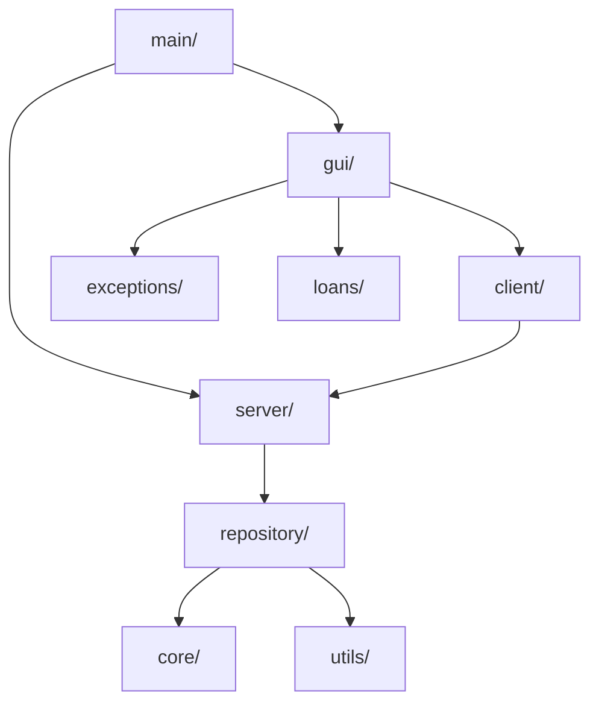

# 🏦 SecureBank: Comprehensive Examination & Viva Guide

This document is your definitive guide for the final project examination. It covers the project from its basic inception to its advanced architectural design, assigns specific speaking roles to the team, and provides a clear breakdown of concepts to present to the examiner.

---

## 1. Introduction: How It Started

### The Vision
The **SecureBank** project began with a core objective: to build a robust, real-world banking application using strictly **Core Java**. Instead of relying on heavy web frameworks, the goal was to prove a deep understanding of Java fundamentals—specifically Object-Oriented Programming (OOP), Multithreading, Network Sockets, and GUI design.

### Target Users
SecureBank is designed for **Bank Tellers, Branch Managers, and Administrators** in a cooperative banking environment. It provides a secure, centralized dashboard for staff to:
* Register and manage customers.
* Process high-volume deposits, withdrawals, and fund transfers.
* Approve and manage loans.
* Generate transaction histories and visual reports.

### Key Professional Features
* **Massive Concurrency:** Capable of handling dozens of customers simultaneously without data corruption, thanks to a strictly synchronized, thread-safe server architecture.
* **Dynamic Professional Theming:** The application completely escapes the "basic college project" look. It features a state-of-the-art **FlatLaf** engine allowing real-time switching between professional themes: **Neon**, **Navy Blue**, and **Darker Black**, along with dynamic font scaling for accessibility.
* **Data Persistence:** A custom file I/O system that securely writes all transactional data to local `.dat` files.

---

## 2. Architecture & Folder Structure

The project is structured using an enterprise-grade package layout. Here is how all the folders connect to each other to make the software work:

### Folder Breakdown
* **`com.securebank.main`**: The entry point of the app. It initializes the theme engine, starts the server in the background, and launches the GUI.
* **`com.securebank.core`**: Contains the blueprint of the bank. (e.g., `Customer`, `Account`, `SavingsAccount`).
* **`com.securebank.gui`**: The beautiful frontend. Contains all the screens (`DashboardPanel`, `SettingsPanel`) and custom components (`SidebarPanel`, `StyledButton`).
* **`com.securebank.server` & `client`**: The networking backbone. The Client sends requests via TCP Sockets, and the Server processes them on dedicated threads.
* **`com.securebank.repository`**: The database layer. Uses Java Generics (`Repository<T>`) to store and retrieve data.
* **`com.securebank.utils`**: Helper classes like `FileIOHelper` (for saving data) and `IDGenerator` (for generating sequential `CUSTOMER-1` IDs).

---

## 3. Team Roles & Viva Assignments

To ace the viva, the presentation is split into two halves: **The Technical Architecture** (handled by Divyansh) and **The Core OOP & Business Logic** (handled by the rest of the team).

### 👨‍💻 Divyansh — Technical Lead & System Architect
*Divyansh handles all the complex coding terms, the architecture, and the heavy lifting. When the examiner asks "How does it work under the hood?", Divyansh steps in.*

**Topics Divyansh Will Explain:**
1. **Client-Server Architecture & Sockets:** Explain how `BankServer.java` opens a `ServerSocket` on port 8888, and how every time a new GUI instance opens, a `Socket` connects to it. Explain that they communicate using a custom string protocol (e.g., `DEPOSIT|ACC-001001|5000`).
2. **Concurrency & Multithreading:** Explain that the server handles *hundreds* of customers at once by spawning a new `Thread` (via `ClientHandler`) for every user. 
3. **The `synchronized` Keyword (CRITICAL):** Explain how we prevent race conditions. If two tellers try to withdraw from the same account at the exact same millisecond, the `synchronized` block acts as a lock, forcing one thread to wait for the other, ensuring the bank never loses track of money.
4. **Generics (`Repository<T>`):** Explain how using `<T>` allowed the team to write the database code just once. Instead of writing separate code for Accounts and Customers, the system dynamically adapts to `Repository<Account>` and `Repository<Customer>`.
5. **Professional GUI & FlatLaf:** Explain how the theme engine was built to swap UIManager properties dynamically, giving it a premium look unlike standard Swing apps.

### 👥 The Rest of the Team — Business Logic & OOP Fundamentals
*The rest of the team will focus on explaining the foundational Object-Oriented concepts. This shows the examiner that the whole team understands the core syllabus.*

**Topics The Team Will Explain:**
1. **Classes and Objects:** Explain how `Customer.java` is a class (a blueprint), and when we log in as `CUSTOMER-1`, we are interacting with a specific *Object* in memory.
2. **Inheritance & Polymorphism:** 
   * **Inheritance:** Show how `SavingsAccount` and `CurrentAccount` inherit from the abstract `Account` class. This avoids rewriting the balance and deposit logic.
   * **Polymorphism:** Explain how the `calculateInterest()` method behaves differently depending on whether the object is a Savings Account (4% interest) or a Current Account (1% interest).
3. **Encapsulation:** Explain how account balances are set to `private`. You cannot directly change a balance; you must use the `deposit()` or `withdraw()` methods, which validate the math first.
4. **Exception Handling:** Walk through custom exceptions like `InsufficientBalanceException`. Explain how the code uses `try/catch` blocks so that if a user tries to withdraw more than they have, the app gracefully shows a toast notification instead of crashing.
5. **Target Audience & Features:** Present the target users and walk the examiner through the user manual.

---

## 4. Feature Walkthrough & Screenshots

During the presentation, show the examiner these core screens to highlight the professional nature of the project.

### The Login Screen
The entry point of the app, ensuring secure access.

### The Dashboard
A centralized hub showing the account overview, quick actions, and recent transaction history.

### Dynamic Settings & Theming
The professional settings area utilizing a clean Tabbed interface where the user can swap between **Neon**, **Navy Blue**, and **Darker Black**.
> *Examiner Note: Emphasize that most Java Swing projects look outdated. This project uses dynamic look-and-feel updates to rival modern web applications.*

### Fund Transfers (Deadlock-Safe)
The transfer panel. *Divyansh can mention here how lock-ordering prevents deadlocks when two accounts transfer to each other simultaneously.*

### Transaction History & Reports
Shows the integration of Java Collections (like `TreeMap`) to sort and filter large amounts of transactional data efficiently.

---
*End of Examination Guide. Print this document to PDF and distribute it to the team before the Viva.*
