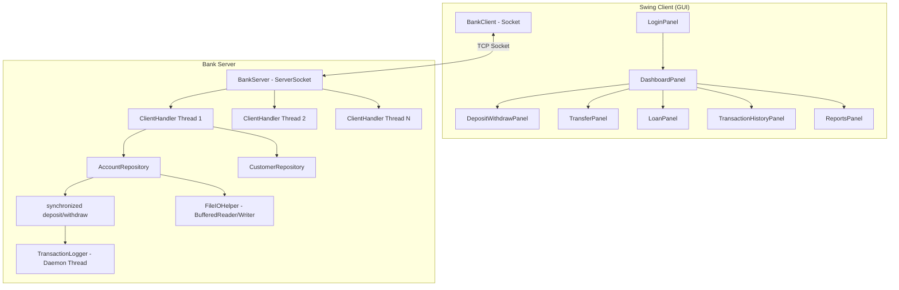

# SecureBank — Cooperative Banking Management System

A full-stack Core Java (Swing + TCP Sockets) capstone project for the OOP Using Java course at NIET. This plan covers every mandatory rubric requirement, the UI/UX approach, build/packaging, and phased delivery order.

---

## Proposed Changes

The entire project will be built from scratch in `d:\DK STUDY\Projects\Java WOrkshop\SecureBank`. I'm proposing a **4-phase build** so you can verify each phase works before I move on.

---

### Phase 1 — Core Domain Model, Repository, Exceptions, Persistence (Foundation)

> **Goal:** All business objects compile. Generic `Repository<T>` works. File I/O persistence round-trips data. Custom exceptions are defined. No GUI yet — this is the engine.

#### [NEW] Build Configuration

##### [NEW] [pom.xml](file:///d:/DK%20STUDY/Projects/Java%20WOrkshop/SecureBank/pom.xml)
- Maven project (`com.securebank:securebank:1.0-SNAPSHOT`, Java 17+)
- Dependencies: `com.formdev:flatlaf:3.7.2` (modern L&F), JUnit 5 for tests
- Maven Shade Plugin to build a fat JAR for `jpackage`

---

##### [NEW] `com.securebank.core` — Domain Classes

| File | Purpose | Key Rubric Coverage |
|------|---------|---------------------|
| `Bank.java` | Top-level entity, holds `List<Branch>` (Aggregation) | Association, Aggregation |
| `Branch.java` | Holds branch code, name, address | Aggregation target |
| `Customer.java` | Name, ID, PIN, contact, `List<Account>` (Association) | Association |
| `Account.java` | **Abstract class** — account number, balance, holder ref, `List<Transaction>` (Composition). `synchronized deposit()` / `withdraw()`, abstract `calculateInterest()`. Overloaded `deposit(double)` and `deposit(double, String)` | Abstract class, Composition, Overloading, synchronized |
| `SavingsAccount.java` | Extends `Account`, implements `calculateInterest()` with savings rate | Overriding, Generalization |
| `CurrentAccount.java` | Extends `Account`, implements `calculateInterest()` with overdraft logic | Overriding, Generalization |
| `Transferable.java` | **Interface** with `transferTo(Account target, double amount)` | Interface requirement |

---

##### [NEW] `com.securebank.transactions` — Transaction Model

| File | Purpose |
|------|---------|
| `Transaction.java` | Immutable record: ID, type, amount, timestamp, remarks, running balance |
| `TransactionType.java` | Enum: `DEPOSIT`, `WITHDRAWAL`, `TRANSFER_IN`, `TRANSFER_OUT`, `INTEREST`, `LOAN_DISBURSEMENT`, `LOAN_REPAYMENT` |
| `TransactionLogger.java` | **Daemon thread** (`setDaemon(true)`) with a `BlockingQueue<Transaction>` — logs transactions to file asynchronously without blocking the app |

---

##### [NEW] `com.securebank.loans`

| File | Purpose |
|------|---------|
| `Loan.java` | Loan amount, interest rate, tenure, EMI, status, linked account |
| `LoanStatus.java` | Enum: `PENDING`, `APPROVED`, `REJECTED`, `ACTIVE`, `CLOSED` |
| `LoanProcessor.java` | Eligibility check, EMI calculation, approval logic |

---

##### [NEW] `com.securebank.exceptions` — Custom Checked Exceptions

All extend `Exception` (checked):
- `InsufficientBalanceException`
- `InvalidPinException`
- `AccountNotFoundException`
- `DailyLimitExceededException`
- `DuplicateAccountException`

Demonstrated with: try-catch, multiple catch, nested try, finally, throw/throws — all in the service/server layer.

---

##### [NEW] `com.securebank.repository` — Generic Repository

| File | Purpose |
|------|---------|
| `Repository.java` | **Generic class `Repository<T>`** with `HashMap<String, T>` backing store. Methods: `add(String id, T)`, `get(String id)`, `update(String id, T)`, `delete(String id)`, `getAll()`, `search(Predicate<T>)` using lambdas. This is the portfolio-differentiating piece. |
| `AccountRepository.java` | Extends/uses `Repository<Account>`, adds file serialization methods |
| `CustomerRepository.java` | Uses `Repository<Customer>`, adds customer-specific queries |

---

##### [NEW] `com.securebank.utils` — Utilities

| File | Purpose |
|------|---------|
| `ReceiptGenerator.java` | Uses `StringBuilder` exclusively (not `+`) to build formatted transaction receipts and account statements |
| `FileIOHelper.java` | Character-stream persistence: `BufferedReader`/`BufferedWriter` to save/load accounts and transactions as delimited text files. Creates `data/` directory on first run if missing. |
| `IDGenerator.java` | Generates unique account numbers, transaction IDs, customer IDs |

---

### Phase 2 — Server, Client, Socket Protocol, Multithreading

> **Goal:** TCP client-server architecture works. Multiple clients can connect. Synchronized methods prevent race conditions. Daemon logger thread runs.

##### [NEW] `com.securebank.server`

| File | Purpose |
|------|---------|
| `BankServer.java` | `ServerSocket` on configurable port (CLI arg). Accepts connections in a loop, spawns `ClientHandler` thread per client. Holds the master `AccountRepository` and `CustomerRepository`. |
| `ClientHandler.java` | `implements Runnable`. Reads requests from client socket's `InputStream`, dispatches to synchronized account methods, writes responses. Protocol is simple text-based (command|param1|param2...). |

##### [NEW] `com.securebank.client`

| File | Purpose |
|------|---------|
| `BankClient.java` | Manages `Socket` connection to server. Sends request strings, reads response strings. Methods like `sendDeposit()`, `sendWithdraw()`, `sendTransfer()`, `requestBalance()`, `authenticate()` etc. Used by GUI panels. |

**Protocol design (simple text, no serialization library):**
```
Request:  COMMAND|param1|param2|...
Response: OK|result_data   or   ERROR|error_message
```
Commands: `LOGIN`, `DEPOSIT`, `WITHDRAW`, `TRANSFER`, `BALANCE`, `HISTORY`, `LOAN_APPLY`, `LOAN_STATUS`, `ACCOUNT_INFO`, `CREATE_ACCOUNT`

---

### Phase 3 — Swing GUI with FlatLaf (The Visual Layer)

> **Goal:** Professional-looking desktop banking app with sidebar navigation, card-based dashboard, all required screens.

##### [NEW] `com.securebank.gui` — Main Screens

| File | Purpose |
|------|---------|
| `SecureBankApp.java` | Main JFrame shell — sets up FlatLaf, sidebar, content area (`CardLayout` for panel switching) |
| `LoginPanel.java` | Customer ID + PIN login with styled inputs, "Processing..." button state during auth |
| `DashboardPanel.java` | Card-based: Balance card, Recent Transactions card, Quick Actions (Deposit/Withdraw/Transfer buttons), mini transaction trend chart (Java2D bar chart) |
| `AccountsPanel.java` | Account details view, interest calculation display |
| `DepositWithdrawPanel.java` | Form with amount input, remarks, submit with loading state |
| `TransferPanel.java` | Source account, target account number, amount, submit |
| `LoanPanel.java` | Loan application form + status view |
| `TransactionHistoryPanel.java` | Searchable/filterable table (`JTable`) with date range, amount filter. Uses lambda/streams for filtering. Jagged array used for monthly summary grid. |
| `ReportsPanel.java` | TreeMap-sorted reports: accounts by balance, transactions by date. Simple charts via Java2D. |
| `SettingsPanel.java` | Dark mode toggle (FlatLightLaf ↔ FlatDarkLaf), font size |

##### [NEW] `com.securebank.gui.components` — Reusable Components

| File | Purpose |
|------|---------|
| `SidebarPanel.java` | Fixed-width dark navy sidebar with icon+label nav items, hover highlight |
| `CardPanel.java` | Rounded-corner JPanel with shadow, configurable title/content |
| `StyledButton.java` | Custom JButton with accent colors, hover effects, loading state ("Processing...") |
| `NotificationPanel.java` | Toast-style notification overlay — slides in from top-right, auto-dismisses. Replaces ugly `JOptionPane`. |
| `StyledTextField.java` | Modern input fields with placeholder text, rounded borders |
| `MiniChart.java` | Simple Java2D bar/line chart component for dashboard |

**Color Palette (applied via UIManager + custom painting):**
- Primary: `#1A2B4C` (sidebar, headers)
- Accent: `#0D7377` (teal buttons), `#F4A261` (amber CTAs)
- Background: `#F5F7FA`
- Success: `#2ECC71`, Error: `#E74C3C`, Warning: `#F39C12`

**Font:** `Segoe UI` set globally via `UIManager.put("defaultFont", ...)`

---

### Phase 4 — Entry Point, Packaging, Documentation

##### [NEW] `com.securebank.main`

| File | Purpose |
|------|---------|
| `Main.java` | Entry point. Accepts CLI arg for server port (`args[0]`). Starts `BankServer` in a background thread, then launches Swing client on EDT. Seeds demo data (2-3 test accounts) on first run. |

##### [NEW] Documentation & Config

| File | Purpose |
|------|---------|
| `README.md` | Full README per deliverable 3 spec (all 12 sections) |
| `TEAM_ROLES.md` | Team work-split mapping 5 NIET roles → packages/files |
| `package.bat` | `jpackage` script with commented flags for Windows EXE |
| `data/` directory | Auto-created at runtime for file persistence |
| `screenshots/` directory | Placeholder for screenshots |

---

## Rubric Coverage Matrix

Every mandatory requirement mapped to its implementation location:

| Rubric Requirement | Where It Lives |
|---|---|
| **Association** (Customer–Account) | `Customer.java` holds `List<Account>` |
| **Aggregation** (Bank–Branch) | `Bank.java` holds `List<Branch>` (branches can exist independently) |
| **Composition** (Account–Transaction) | `Account.java` owns `List<Transaction>` (transactions die with account) |
| **Generalization** | `Account` → `SavingsAccount`, `CurrentAccount` |
| **Abstract class + method** | `Account.calculateInterest()` |
| **Interface** | `Transferable` implemented by Account subclasses |
| **Method Overloading** | `Account.deposit(double)` and `Account.deposit(double, String)` |
| **Method Overriding** | `calculateInterest()` in both subclasses |
| **Arrays / Jagged arrays** | Monthly transaction summary grid in `TransactionHistoryPanel` |
| **Lambda + Streams** | Transaction filtering, `Repository.search(Predicate<T>)` |
| **Packages** | 10 packages as specified |
| **Custom exceptions (5)** | All in `com.securebank.exceptions` |
| **try-catch/multi-catch/nested/finally/throw/throws** | Server `ClientHandler`, Account methods, FileIOHelper |
| **StringBuilder** | `ReceiptGenerator` for receipts/statements |
| **Multithreading (Runnable)** | `ClientHandler implements Runnable` |
| **synchronized** | `Account.deposit()`, `Account.withdraw()` |
| **Daemon thread** | `TransactionLogger` |
| **File I/O (Character streams)** | `FileIOHelper` with BufferedReader/BufferedWriter |
| **TCP Sockets** | `BankServer` (ServerSocket), `BankClient` (Socket) |
| **Swing GUI** | All panels in `com.securebank.gui` |
| **Collections** | `HashMap<String, Account>`, `ArrayList<Transaction>`, `TreeMap` for reports |
| **Generics** | `Repository<T>` — the standout piece |
| **CLI args** | `Main.java` accepts port number |
| **Constructors** | Every domain class |
| **Control statements** | Throughout all logic |

---

## Architecture Diagram



---

## Build Order & Estimated File Count

| Phase | Files | What You Can Demo |
|-------|-------|-------------------|
| Phase 1 | ~20 files | Core classes compile, unit test Repository, file I/O round-trips |
| Phase 2 | ~4 files | Start server, connect client, deposit/withdraw via console |
| Phase 3 | ~14 files | Full GUI — login, dashboard, all screens |
| Phase 4 | ~5 files | Packaged EXE, README, team roles |
| **Total** | **~43 Java files + 4 config/docs** | |

---

## User Review Required

> [!IMPORTANT]
> **Build tool choice:** I'm proposing **Maven** for dependency management (FlatLaf JAR, fat JAR packaging). If you prefer Gradle or manual JAR management, let me know.

> [!IMPORTANT]
> **Java version:** I'll target **Java 17** (LTS) since `jpackage` is stable there and it's widely available. Confirm if you need a different version.

> [!IMPORTANT]
> **Demo data:** On first run, the app will seed 2-3 demo accounts (with known PINs printed to console) so you can immediately demo without creating accounts first. The "Create Account" flow will also work for creating new ones.

---

## Open Questions

1. **Team size**: You mentioned 3–5 members. Do you have a confirmed count? This affects how I split `TEAM_ROLES.md`.  
   *(I'll default to 5 and you can adjust.)*

2. **Icons**: FlatLaf supports SVG icons natively. I'll create simple Unicode/emoji-based sidebar icons initially (e.g., 🏠 Dashboard, 💰 Accounts) and note where you can drop in SVG files later. Acceptable?

3. **Stitch MCP**: I'll attempt to use Stitch AI for design references for the major screens. If the Stitch MCP tools don't provide useful output for Swing desktop layouts, I'll proceed with my own design decisions based on the color palette and layout spec you provided. OK?

---

## Verification Plan

### Automated Tests
- Compile check: `mvn compile` must succeed
- Unit tests for `Repository<T>` CRUD operations, `Account` synchronized methods, custom exceptions
- `mvn test` to run all tests

### Manual Verification
- Start server → Start client → Login → Deposit → Withdraw → Transfer → View history → Apply for loan → View reports
- Verify file persistence: stop server, restart, data still present
- Verify concurrent access: open 2 client instances, deposit simultaneously, no race condition
- Verify daemon thread: TransactionLogger writes to log file, doesn't block shutdown
- Verify CLI arg: `java -jar securebank.jar 9090` starts on port 9090
